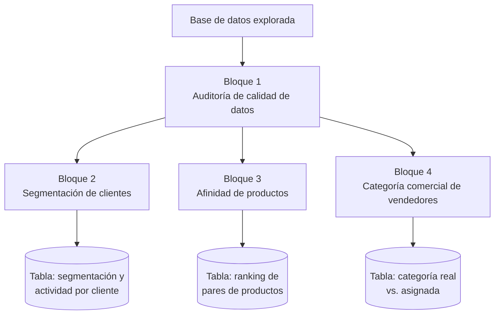

# Propuesta de proyecto — Taller de Base de Datos

## Panel de Inteligencia de Negocios

La base de datos entregada para este examen transversal registra con precisión cada venta, cada línea de detalle, cada anticipo y cada tramo de comisión de la fuerza de vendedores. Es, en ese sentido, un motor transaccional bien diseñado: cumple exactamente la función para la que fue construido. Pero un motor transaccional no está pensado para responder preguntas de gestión, y ahí es donde detectamos la oportunidad de este proyecto.

Se revisan los datos que ya existen en las tablas entregadas, y encontramos situaciones concretas que justifican el análisis por sí solas. El cliente 10, por ejemplo, está registrado en la cartera comercial pero no tiene una sola venta asociada en todo el período disponible. El vendedor 75 aparece categorizado en un nivel intermedio (categoría C) pese a que su volumen de ventas del período es, por lejos, el más bajo de los quince vendedores activos — mientras que otros dos vendedores están categorizados en el nivel más alto (A) con un desempeño de venta muy por debajo del que esa categoría debiera representar. Ninguna consulta SQL simple sobre venta o vendedor deja esto en evidencia de forma directa; hay que cruzar información, acumularla y aplicarle una regla de negocio.

A partir de esos hallazgos, proponemos abordar el proyecto como un panel de inteligencia de negocios compuesto por cuatro frentes de análisis, cada uno respondiendo una pregunta de gestión distinta pero complementaria.

---

### Roadmap del proyecto

El Bloque 1 corre primero y condiciona a los otros tres: solo con los datos ya auditados tiene sentido segmentar, buscar afinidad de productos o revisar categorías. Los Bloques 2, 3 y 4 son independientes entre sí y cada uno cierra en su propia tabla de resultados.

---

### Bloque 1 — Auditoría de calidad de datos

Identifica ventas sin vendedor asignado y clientes sin actividad registrada, como paso previo obligatorio antes de confiar en cualquier cálculo posterior.

### Bloque 2 — Segmentación de clientes por volumen de compra

Clasifica la cartera de clientes según su volumen de compra y detecta, además, clientes que llevan más tiempo del esperado sin comprar.
→ Resultado materializado en tabla propia: segmentación y estado de actividad por cliente.

### Bloque 3 — Análisis de afinidad de productos

Identifica qué artículos se venden juntos con mayor frecuencia, como insumo para decisiones de surtido o promociones combinadas.
→ Resultado materializado en tabla propia: ranking de pares de productos.

### Bloque 4 — Auditoría de categoría comercial de vendedores

Contrasta la categoría comercial que tiene asignada hoy cada vendedor contra la que le correspondería según su desempeño real de ventas.
→ Resultado materializado en tabla propia: comparación de categoría real vs. asignada por vendedor.

---

### Enfoque 

Los cuatro frentes se resuelven con bloques PL/SQL propios, aplicando en cada uno tipos de datos compuestos, cursores explícitos anidados y control de excepciones — la lógica interna de cada bloque se detalla en el desarrollo del informe y no es el foco de esta propuesta.

Como aporte adicional a lo exigido por la pauta, no nos vamos a quedar en que los resultados se impriman por consola y se pierdan al cerrar la sesión: cada bloque deja sus resultados disponibles para consultarse directamente o conectarse a una herramienta de reporte, sin depender de volver a ejecutar el bloque PL/SQL cada vez que alguien necesite revisarla.

### Proximos Pasos

Solicitar una retroalimentacion inicial para corregir todo lo planificado y si cumple con lo esperado por el profesor.
